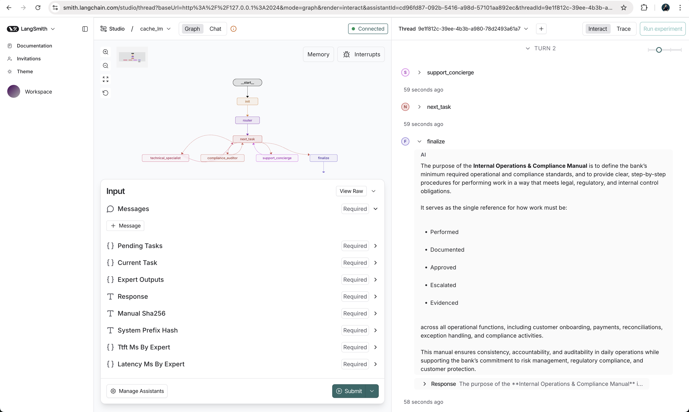

# cache-lm — High-Efficiency Multi-Agent Orchestration (LangGraph)

This repo is my submission for `TechnicalAssignment.md`.

I built a LangGraph multi-agent workflow (router + 3 experts) around a large, immutable “Operations & Compliance Manual”. The main thing I’m demonstrating is how to structure prompts for **KV/prefix caching** and how to measure **TTFT** when multiple agents are called in sequence.

The manual lives at `data/operations_manual.md` and I treat it as read-only.

If you’re reviewing, these docs are the easiest entry points:

- Environment setup: `ENV.md`
- Implementation walkthrough: `src/cache_lm/README.md`
- Test-by-test coverage notes: `tests/README.md`

## Quickstart

- Install: `python -m pip install -e .`
- CLI help: `cache-lm --help`
- Offline tests (no network): `python -m pytest -q`
- Integration tests (uses `.env`): `set -a; source .env; set +a; python -m pytest -q -m integration`

On my machine, I see output like:

```text
$ python -m pytest -q
.................                                                            [100%]
17 passed in 18.51s

$ set -a; source .env; set +a; python -m pytest -q -m integration
....                                                                      [100%]
4 passed, 13 deselected in 18.79s
```

Local server (LangGraph Agent Server):

- Configure env vars (copy `.env.example` → `.env`): `ENV.md`
- Install CLI: `pip install -U "langgraph-cli[inmem]"`
- Run: `langgraph dev`

On my machine, `langgraph dev` prints startup logs like:

```text
$ langgraph dev
...
- 🚀 API: http://127.0.0.1:2024
- 🎨 Studio UI: https://smith.langchain.com/studio/?baseUrl=http://127.0.0.1:2024
- 📚 API Docs: http://127.0.0.1:2024/docs
...
Server started in 0.71s
🎨 Opening Studio in your browser...
```

I also included a screenshot of the Studio UI and the graph:



## Constraints

- Never edit the manual (`data/operations_manual.md`)—no trimming, reformatting, or normalization.
- Keep secrets local (`.env` is git-ignored). Nothing sensitive is committed.

## Tests

I keep unit tests offline and deterministic, and I gate all live endpoint tests behind `RUN_LLM_TESTS=1`. Details: `tests/README.md`.

## CLI Usage

- Manual fingerprint: `cache-lm manual-stats`
- One turn: `cache-lm run --input "What are the minimum logging expectations?"`
- Full state JSON: `cache-lm run --input "What are the minimum logging expectations?" --json`
- Show TTFT/latency (LLM mode): `cache-lm run --input "..." --show-metrics`

Here’s a real example of a one-turn CLI run (output will vary slightly by model, but should stay grounded in the manual):

```text
$ cache-lm run --input "What are the minimum logging expectations?"
Minimum logging expectations (from the manual’s “Logging, audit trails, and monitoring expectations” section):

- User identity
- Timestamps
- Actions performed (create/approve/modify/override, etc.)
- Before/after values for sensitive changes (where feasible)
- Authorization/approval references (ticket/workflow IDs)
```

If you want the full final graph state (including per-expert metrics and the prefix hashes), use `--json`:

```text
$ cache-lm run --input "What are the minimum logging expectations?" --json
{
  "...": "...",
  "response": "...",
  "manual_sha256": "1b2774…",
  "system_prefix_hash": "55f0b8…",
  "ttft_ms_by_expert": {"support_concierge": 999.1},
  "latency_ms_by_expert": {"support_concierge": 4743.9}
}
```

### Persistence / Threads (CLI)

Use `--checkpoint-db` + `--thread-id` to persist conversation history across invocations (manual prefix remains invariant; only user/assistant messages are checkpointed).

I use this to show that the conversation can grow while the manual prefix stays fixed. Example:

- First turn:
  - `cache-lm run --checkpoint-db .cache_lm/checkpoints.sqlite --thread-id t1 --input "What are the minimum logging expectations, and can I do approvals in chat?"`
- Second turn (same thread):
  - `cache-lm run --checkpoint-db .cache_lm/checkpoints.sqlite --thread-id t1 --input "Summarize that in steps."`

On the first turn, I expect the system to (1) summarize the minimum logging fields and (2) clearly state that approvals should not happen in chat (they should be recorded in a controlled ticket/workflow system for auditability). On the second turn, I expect the answer to reference the prior turn from the same thread without re-sending the manual into the persisted state.

Example output (trimmed):

```text
$ cache-lm run --checkpoint-db .cache_lm/checkpoints.sqlite --thread-id t1 --input "What are the minimum logging expectations, and can I do approvals in chat?"
Minimum logging expectations:
- User identity
- Timestamps
- Actions performed
- Before/after values (where feasible)
- Ticket/workflow references

Approvals in chat: no — approvals must be recorded in a controlled system for auditability.
```

```text
$ cache-lm run --checkpoint-db .cache_lm/checkpoints.sqlite --thread-id t1 --input "Summarize that in steps."
1. Log user identity, timestamps, actions, before/after values, and approval references.
2. Store logs in approved, auditable systems and retain them per policy.
3. Do not do approvals in chat; use tickets/workflows instead.
```

## How This Meets the Assignment

### High Cache Hit Rate (Prefix Caching)

My prompt structure is designed so a serving engine can cache the 25k-token manual once and reuse it across experts:

- **System #1 (invariant):** global instruction + full manual (verbatim)
- **System #2 (expert):** persona + formatting rules
- **Dynamic:** history (user/assistant only) + current user input

The key rule is that the manual and any invariant instructions always appear first and are byte-identical across expert calls. I also keep the manual out of persisted state (only hashes are persisted).

If you want the code-level walkthrough, see `src/cache_lm/README.md`.

### Persistent State (Threads Without Reprocessing the Manual)

Conversation history grows via LangGraph threads/checkpointing, but the manual prefix stays invariant because:

- I only persist user/assistant messages in `messages`
- I recompute the system/manual prefix at call time from the manual file (verbatim)
- I persist only small fingerprints like `manual_sha256` and `system_prefix_hash`

The CLI example above shows a two-turn thread using SQLite, and `tests/test_persistence_threads.py` asserts the manual text never ends up in checkpoints.

### Reduced TTFT for 2nd/3rd Expert Calls

When running in `CACHE_LM_MODE=llm`, each expert streams tokens and I record TTFT and total latency per expert. In sequential mode, later experts in the same user turn should benefit from a warmed prefix cache (same System #1) on backends that support it.

## TTFT Measurement (Streaming)

To reproduce (requires `.env` with `OPENAI_*`):

- `cache-lm run --input "Can I do approvals in chat, and what are the minimum logging expectations? Summarize in steps." --show-metrics`

On my machine, I see output like this (trimmed):

```text
$ cache-lm run --input "Can I do approvals in chat, and what are the minimum logging expectations? Summarize in steps." --show-metrics
No — you cannot perform formal approvals in chat.
Approvals must be done through official workflows or ticketing systems for auditability.

1. Do not approve in chat; use a controlled system.
2. Ensure the system logs user identity, timestamps, actions, before/after values (where feasible), and ticket/workflow references.
3. Retain logs per the retention schedule.

metrics:
- compliance_auditor: ttft_ms=2920.9 latency_ms=6576.7 (This is the first prefill—if this is the first time you send the manual to vLLM, the prefill must run without cache.)
- support_concierge: ttft_ms=1398.8 latency_ms=5092.9
```

One small nuance: the CLI prints the final answer, but under the hood each expert call uses **streaming** so I can record TTFT (time to the first streamed token). If you want to see streaming behavior interactively, `langgraph dev` + Studio is the easiest way to do it.

In practice there’s noise (cold starts, network jitter), so I recommend repeating runs and comparing distributions rather than a single number.

## Parallel Expert Execution

Switch to parallel fan-out:

- `CACHE_LM_EXPERT_EXECUTION=parallel cache-lm run --input "..." --show-metrics`

By default, I run experts **sequentially** because it makes the “2nd/3rd expert benefits from a warmed prefix cache” effect easiest to observe on prefix-caching backends, but when I care more about **total wall time** I switch to parallel fan-out (`CACHE_LM_EXPERT_EXECUTION=parallel cache-lm run --input "..." --show-metrics`): the router can still pick 1–3 experts, but their calls start at the same time, so end-to-end latency trends toward the **slowest** expert (plus small orchestration overhead) rather than the **sum** of expert latencies. This is most effective when a single turn truly needs multiple specialists and the serving backend has enough capacity for concurrent requests, though it can weaken the “later experts get better TTFT” signal (because they aren’t actually later) and may increase TTFT/latency variance if requests contend for throughput. It’s still safe because outputs and metrics merge deterministically via graph-state reducers (e.g., `expert_outputs`, `ttft_ms_by_expert`, `latency_ms_by_expert` are mergeable dicts), each expert uses the same `messages` snapshot for prompt construction, and the manual is never persisted (it’s loaded verbatim at call time); see `src/cache_lm/graph.py`, `src/cache_lm/state.py`, and `src/cache_lm/experts.py` for the wiring.

## Production Monitoring (Langfuse + vLLM Logs + Grafana)

I’m not shipping a full observability stack in this assignment, but here’s how I would monitor the “efficiency” claims in production:

### Langfuse (Tracing)

In production I’d use **Langfuse** to trace what the graph actually did and tie it to timing, without ever uploading the manual itself. Each user turn becomes **one trace**, tagged with safe correlation identifiers like `run_id`, `thread_id` (if enabled), `manual_sha256`, and `system_prefix_hash`, so I can group and compare runs across deploys. Inside that trace, each node becomes **a span**: the router span records `router_mode`, the selected `experts_called`, router latency, and any parse/fallback flags; each expert span records `expert_name`, TTFT, total latency, token counts if available, plus non-secret serving metadata like model name and endpoint/base URL. To keep cost and noise under control, I’d sample heavily for healthy traffic but keep **100% sampling for errors and slow runs**, so tail-latency regressions and routing failures remain fully observable.

### vLLM Logs/Metrics (Ground Truth)

Even if the app reports TTFT and total latency, **vLLM is the ground truth** for _why_ those numbers look the way they do, especially under load. I’d rely on vLLM’s request-level logs/metrics to separate **queueing** from **compute** (queue time vs prefill vs decode), track throughput (tokens/sec), concurrency, and error/timeout rates, and capture any cache- or prefill-related counters that the serving setup exposes. When debugging tail latency, I’d correlate the app’s `run_id` and timestamps with vLLM request logs to pinpoint whether a bad p95/p99 was caused by saturation/queueing, network overhead, or model execution—because the fix is different in each case (capacity vs routing vs prompt/prefix stability).

### Grafana (Dashboards + Alerts)

I’d put **Grafana** on top of the emitted app metadata + vLLM metrics to make the “efficiency claims” visible as dashboards and enforceable via alerts. The core dashboards would track golden signals split by expert and execution mode: TTFT p50/p95/p99 per expert and per route (single vs multi-expert), total latency per expert and end-to-end, and error rates (router parse failures, fallbacks, model timeouts, non-200 responses), alongside serving health (queue time, concurrency, saturation). I’d also add **prefix drift monitoring** by charting the distribution of `system_prefix_hash` (and `manual_sha256`) by deploy version, then alert if a new hash appears unexpectedly—because that usually indicates prompt ordering/manual handling changed and prefix caching assumptions may no longer hold. Practical alerts include TTFT p95 regression > X% for Y minutes per expert, spikes in router parse/fallback rates, spikes in server-side 5xx/timeouts, and any unexpected `system_prefix_hash` changes.

## Notes for Reviewers

- If you want to understand the code quickly: start with `src/cache_lm/README.md`.
- If you want to understand the test coverage quickly: start with `tests/README.md`.
